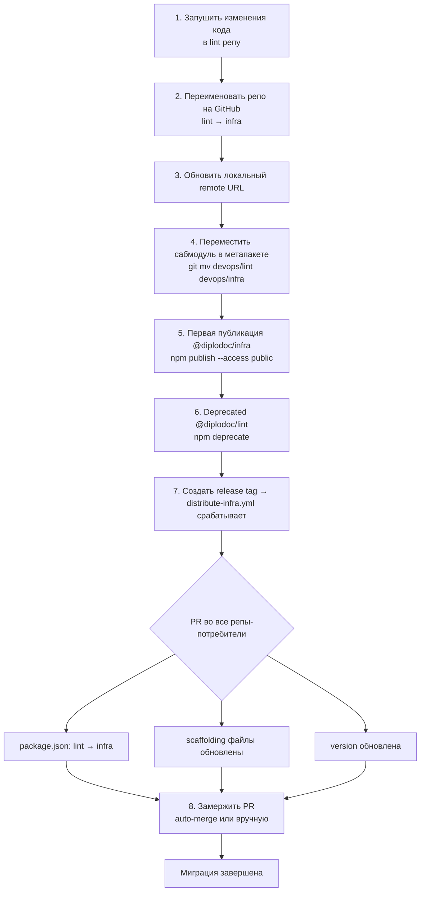

# Миграция: @diplodoc/lint → @diplodoc/infra

## Обзор

Пакет `@diplodoc/lint` переименовывается в `@diplodoc/infra`. Помимо смены имени,
меняется модель распространения инфраструктуры: вместо pull-модели (потребитель тянет
обновления при `npm run lint`) используется push-модель (infra сама создаёт PR в каждой репе).

## Диаграмма процесса миграции



## Пошаговая инструкция

### Шаг 1. Запушить все изменения кода в lint репу

Все изменения (новый `bin/infra.js`, обновлённый `package.json`, workflows,
`distribution.yml`, scaffolding и т.д.) нужно сначала запушить в текущую
репу `diplodoc-platform/lint`, пока она ещё не переименована.

```bash
cd devops/lint

git add -A
git commit -m "feat!: rename to @diplodoc/infra, switch to push distribution model

BREAKING CHANGE: package renamed from @diplodoc/lint to @diplodoc/infra.
npm run lint no longer pulls infrastructure updates.
Infrastructure is now distributed via automated PRs."

git push origin master
```

> **Важно:** Пушим именно в `lint` репу — она пока что так называется.
> Все workflows и конфиги уже подготовлены к новому имени.

### Шаг 2. Переименовать репозиторий на GitHub

```
GitHub → diplodoc-platform/lint → Settings → General → Repository name → "infra" → Rename
```

GitHub автоматически создаст редирект со старого URL. Существующие клоны и
ссылки (`git@github.com:diplodoc-platform/lint.git`) продолжат работать через редирект.

### Шаг 3. Обновить remote URL локально

```bash
cd devops/lint

git remote set-url origin git@github.com:diplodoc-platform/infra.git
git remote -v  # Проверить
```

### Шаг 4. Переместить сабмодуль в метапакете

```bash
cd /Users/gold-serg/Projects/diplodoc

# Переместить сабмодуль (обновит .gitmodules и .git/config)
git mv devops/lint devops/infra

# Убедиться что URL обновился
git config -f .gitmodules submodule.devops/infra.url git@github.com:diplodoc-platform/infra.git

# Синхронизировать конфигурацию
git submodule sync

# Закоммитить и запушить
git add .gitmodules devops/infra
git commit -m "chore: rename submodule devops/lint → devops/infra"
git push
```

### Шаг 5. Первая публикация @diplodoc/infra в npm

```bash
cd devops/infra

# Убедиться что в package.json:
#   "name": "@diplodoc/infra"
#   "version": "1.0.0"

# Первая публикация нового scoped-пакета
npm publish --access public
```

> **Примечание:** `--access public` обязателен для первой публикации scoped-пакета.
> При последующих публикациях (через release-please) он не нужен — npm запоминает настройку.

### Шаг 6. Пометить старый пакет как deprecated

```bash
npm deprecate @diplodoc/lint "Renamed to @diplodoc/infra. Update: npm i -D @diplodoc/infra"
```

### Шаг 7. Создать release и запустить распространение

Вариант А — создать release через GitHub (триггерит `distribute-infra.yml` автоматически):

```bash
gh release create v1.0.0 \
  --repo diplodoc-platform/infra \
  --title "v1.0.0" \
  --notes "Initial release as @diplodoc/infra (renamed from @diplodoc/lint).

## Breaking Changes
- Package renamed: \`@diplodoc/lint\` → \`@diplodoc/infra\`
- \`npm run lint\` no longer pulls infrastructure updates
- Infrastructure updates now distributed via automated PRs"
```

Вариант Б — ручной запуск workflow (если релиз уже создан или не нужен):

```bash
gh workflow run distribute-infra.yml \
  --repo diplodoc-platform/infra \
  --field target=all \
  --field version=v1.0.0
```

Workflow автоматически для каждой репы-потребителя:

- Склонирует репу
- Скопирует scaffolding файлы (уже ссылаются на `@diplodoc/infra`)
- Заменит `@diplodoc/lint` → `@diplodoc/infra` в `devDependencies`
- Обновит версию до `1.0.0`
- Создаст PR `chore: update infrastructure to v1.0.0`

### Шаг 8. Замержить PR в потребителях

Если `auto_merge: true` в `distribution.yml` — PR замержится сам после прохождения CI.
Если `auto_merge: false` (текущий default) — вручную просмотреть и замержить каждый PR.

> Все PR будут одинакового формата и создадутся параллельно (max 5 одновременно).

### Шаг 9. Обновить локальные окружения других разработчиков

Другим разработчикам метапакета достаточно:

```bash
git pull
git submodule sync
git submodule update --init
```

---

## Что произойдёт в каждой репе-потребителе при мерже PR

| Файл                                 | Изменение                                                          |
| ------------------------------------ | ------------------------------------------------------------------ |
| `package.json`                       | `@diplodoc/lint` удалён → `@diplodoc/infra: "1.0.0"` добавлен      |
| `.eslintrc.js`                       | `require('@diplodoc/lint/...')` → `require('@diplodoc/infra/...')` |
| `.prettierrc.js`                     | Аналогично                                                         |
| `.stylelintrc.js`                    | Аналогично                                                         |
| `.lintstagedrc.js`                   | Аналогично                                                         |
| `.github/workflows/*`                | Обновлены из scaffolding (если не в blacklist)                     |
| `esbuild/build.mjs`                  | `@diplodoc/lint/esbuild` → `@diplodoc/infra/esbuild` (см. ниже)    |
| Прочие `*.mjs/*.js/*.ts/*.tsx/*.cjs` | `@diplodoc/lint` → `@diplodoc/infra` (см. ниже)                    |
| `package-lock.json`                  | Пересоздан с новым пакетом                                         |

> **Про `esbuild/build.mjs` и другие source-файлы:** scaffolding **не распространяет**
> `build.mjs` (он в каждой репе свой). Чтобы починить импорт `@diplodoc/lint/esbuild`
> на лету, в `distribute-infra.yml` есть **временный** шаг
> `MIGRATION: Replace legacy @diplodoc/lint references in source files`, который
> прогоняет `sed` по `*.mjs/*.cjs/*.js/*.ts/*.tsx` в репе. Этот шаг нужно выпилить
> после завершения миграции — см. раздел [Cleanup после миграции](#cleanup-после-миграции).

---

## Что меняется в командах

| Было                  | Стало                                    | Разница                                                |
| --------------------- | ---------------------------------------- | ------------------------------------------------------ |
| `npm run lint`        | `npm run lint`                           | Теперь **только линтинг**, без подтягивания обновлений |
| `lint update && lint` | `lint`                                   | `update` убран из скриптов потребителей                |
| `lint init`           | `infra init`                             | Новая команда для инициализации                        |
| —                     | `infra sync --target ./path --repo name` | Применить scaffolding к целевой папке                  |
| —                     | `infra blacklist show`                   | Показать blacklist для репы                            |

---

## Обратная совместимость

- Бинарный файл `lint` **сохранён** — `npm run lint` продолжает работать
- Конфиги (`.eslintrc.js` и т.д.) некоторое время будут проверять оба имени пакета
- GitHub редирект с `diplodoc-platform/lint` → `diplodoc-platform/infra` работает автоматически
- Если в потребителе осталась старая зависимость `@diplodoc/lint` — следующий distribute-PR заменит её

---

## FAQ

### Новая репа добавлена в мультирепу — что произойдёт?

1. При пуше в master `.gitmodules` с новым сабмодулем → `sync-packages-list.yml` сработает
2. Новая репа будет добавлена в `distribution.yml`
3. **Автоматически** запустится `distribute-infra.yml` для этой репы
4. PR с инфраструктурой будет создан в новой репе

Если workflow не сработал (например, `.gitmodules` обновили без пуша в master):

```bash
gh workflow run distribute-infra.yml \
  --repo diplodoc-platform/infra \
  --field target=<имя-новой-репы>
```

### Нужно ли обновлять package-template?

Да. После миграции обнови `package-template` чтобы новые репы сразу ссылались на `@diplodoc/infra`.

### Что если CI упадёт в потребителе после PR?

1. Проверь какой файл вызвал проблему
2. Добавь его в blacklist (`.infrarc.yml` в репе ИЛИ `distribution.yml` централизованно)
3. Пересоздай PR: ручной запуск `distribute-infra.yml` с `target=<repo>`

---

## Cleanup после миграции

В `distribute-infra.yml` есть **временный** шаг
`MIGRATION: Replace legacy @diplodoc/lint references in source files`, который на лету
заменяет старое имя пакета на новое в source-файлах потребителей. Он нужен **только на
переходный период**, пока не все репы прошли через первый distribute-PR. Его обязательно
нужно удалить, чтобы workflow не делал лишнюю работу и не маскировал случайно
вернувшиеся ссылки на старый пакет.

### Когда удалять

Шаг можно выпиливать, когда выполнены **все** условия:

- [ ] Все репы из `distribution.yml` получили distribute-PR хотя бы один раз и он замержен
- [ ] В мастер-ветке каждой репы из `distribution.yml` поиск `@diplodoc/lint` по
      `*.mjs/*.cjs/*.js/*.ts/*.tsx` ничего не находит
- [ ] `package-template` обновлён (новые репы стартуют сразу с `@diplodoc/infra`)
- [ ] Старый пакет `@diplodoc/lint` помечен deprecated на npm (см. шаг 6)

### Как проверить, что нигде не осталось старых ссылок

Скрипт для прохода по всем репам из `distribution.yml`:

```bash
# Из корня infra репы
node -e "
  const yaml = require('js-yaml');
  const fs = require('fs');
  const config = yaml.load(fs.readFileSync('distribution.yml', 'utf8'));
  console.log(Object.keys(config.repos || {}).join('\n'));
" | while read repo; do
  echo "=== $repo ==="
  gh api "search/code?q=org:diplodoc-platform+repo:diplodoc-platform/$repo+@diplodoc/lint" \
    --jq '.total_count'
done
```

Если для всех реп `total_count` равен `0` — миграция завершена.

### Как удалить шаг

В `.github/workflows/distribute-infra.yml` удалить весь блок между маркерами:

```
# === BEGIN MIGRATION: @diplodoc/lint → @diplodoc/infra (REMOVE AFTER DONE) ===
...
# === END MIGRATION ===
```

И этот раздел `Cleanup после миграции` из текущего файла.

Также после полного перехода стоит:

- Удалить из `Update @diplodoc/infra version in package.json` ветку
  `if (pkg[depType]['@diplodoc/lint']) { ... }` — она тоже временная.
- Удалить упоминания `@diplodoc/lint` из таблицы «Что произойдёт в каждой репе-потребителе».

После этого закрыть migration-issue.
